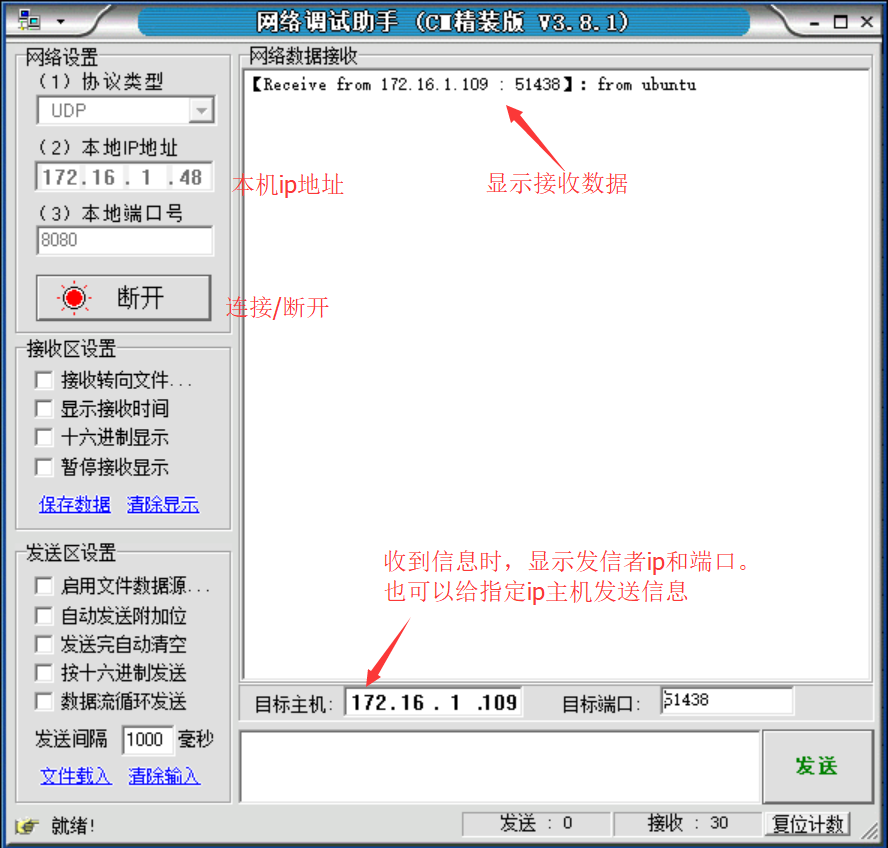

# 安装网络调试助手

### 1.window安装网络调试助手

> 下载地址：**[http://download.csdn.net/download/chexlong/7376475](http://download.csdn.net/download/chexlong/7376475)**

 
> 无需安装，直接运行**NetAssist.exe**

### 2.关闭防火墙

* 关闭本机防火墙，否则VMware Ubuntu虚拟机无法发送数据给本机

* win10关闭防火墙如下：

### 3.禁用VMware网络适配器

### 4.VMware桥接网卡

* VMware设置桥接网卡，保证虚拟机和本机ip同一个网段:

	`右键虚拟机->设置->网络适配器->选择桥接模式`，确定后等待一段时间/或者重启虚拟机

* 虚拟机ping本机ip确认是否可以通信

