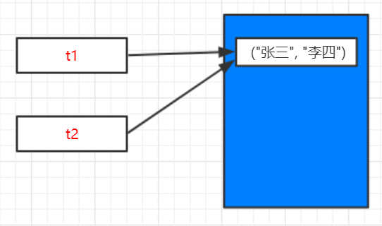
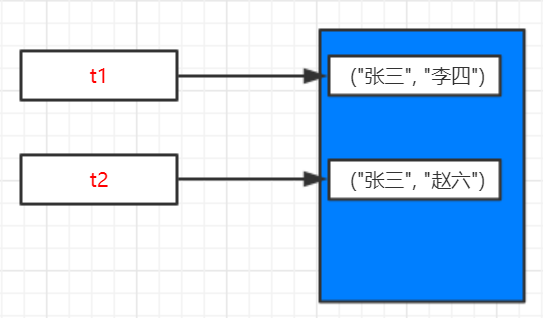

# 不可变类型-元组

**元组**也是不可变类型


```
t1 = ("张三", "李四")
t2 = t1
print("t1=%s, t2=%s" % (t1, t2))
print("t1 id=%d, t2 id=%d" % (id(t1), id(t2)))

print("----------------------------")

t2 = ("张三", "赵六")
print("t1=%s, t2=%s" % (t1, t2))
print("t1 id=%d, t2 id=%d" % (id(t1), id(t2)))
```

> **输出：**

```
t1=('张三', '李四'), t2=('张三', '李四')
t1 id=85161424, t2 id=85161424
----------------------------
t1=('张三', '李四'), t2=('张三', '赵六')
t1 id=85161424, t2 id=85161464
```

> **分析：**

`t2=t1`两个变量指向同一内存区域，id相同





`t2 = ("张三", "赵六")`由于元组为**不可变**类型，所以t2不再指向t1所属内存区域，而是申请新的内存区域，通过id()函数可知两个变量不同。


