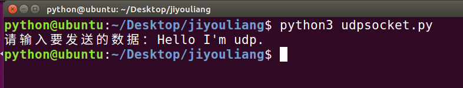
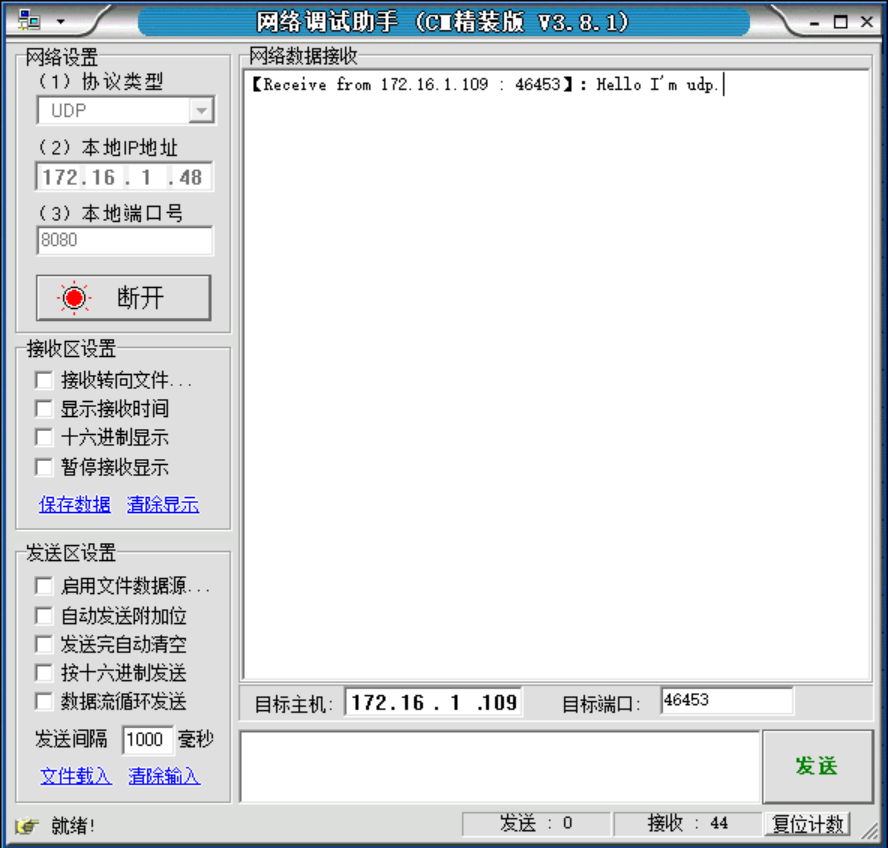

# python编写udp，网络调试助手获取数据

### 1.虚拟机中编写upd代码

	import socket

	def main():
	    # 创建一个udp套接字
	    udp_socket = socket.socket(socket.AF_INET, socket.SOCK_DGRAM)
	
	    # 从键盘获取数据
	    send_data = input("请输入要发送的数据：")
	
	    # 可以使用套接字收发数据
	    # udp_socket.sendto("hahahah", 对方的ip以及port)
	    udp_socket.sendto(send_data.encode("utf-8"), ("172.16.1.48", 8080))
	
	
	    # 关闭套接字
	    udp_socket.close()
		
	
	if __name__ == "__main__":
	    main()

> 运行发送数据

### 2.本机通过NetAssist获取数据

