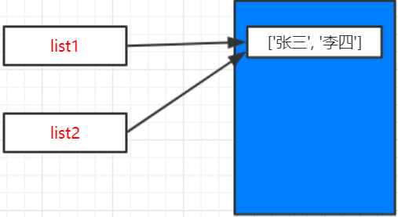
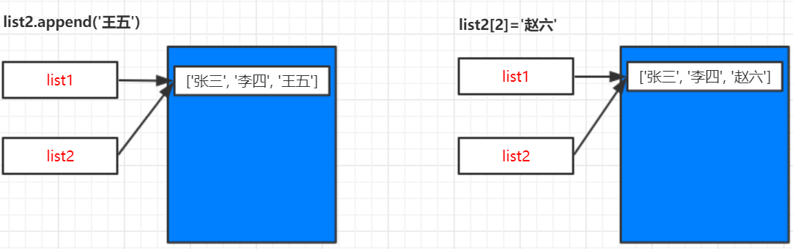

# 可变类型-列表

**list**是可变类型


```
list1 = ['张三', '李四']
list2 = list1
print("list1=%s, list2=%s" % (list1, list2))
print("list1 id=%d, list2 id=%d" % (id(list1), id(list2)))

print("----------------------------")
list2.append('王五')
print("list1=%s, list2=%s" % (list1, list2))
print("list1 id=%d, list2 id=%d" % (id(list1), id(list2)))

print("----------------------------")
list2[2] = '赵六'
print("list1=%s, list2=%s" % (list1, list2))
print("list1 id=%d, list2 id=%d" % (id(list1), id(list2)))

```

> **输出：**

```
list1=['张三', '李四'], list2=['张三', '李四']
list1 id=81525976, list2 id=81525976
----------------------------
list1=['张三', '李四', '王五'], list2=['张三', '李四', '王五']
list1 id=81525976, list2 id=81525976
----------------------------
list1=['张三', '李四', '赵六'], list2=['张三', '李四', '赵六']
list1 id=81525976, list2 id=81525976
```

> **分析：**

`list1=list2`两个变量指向同一内存区域，id相同





`list2.append('王五')`新增元素，修改了列表，但是id和之前是一样的。`list2[2] = '赵六'`修改列表元素，列表list1和list2的id同样没有发生改变。

**对于同一块内存区域，可以修改存储内容（value），那么这种数据类型就是可变类型。**


