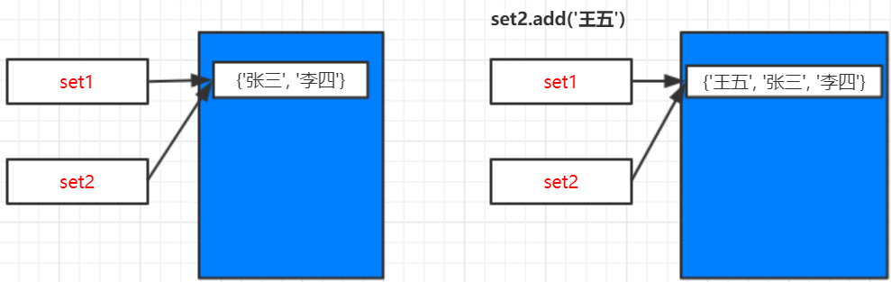

# 可变类型-集合

**set**是可变类型


```
set1 = {'张三', '李四'}
set2 = set1
print("set1=%s, set2=%s" % (set1, set2))
print("set1 id=%d, set2 id=%d" % (id(set1), id(set2)))

print("----------------------------")
set2.add('王五')
print("set1=%s, set2=%s" % (set1, set2))
print("set1 id=%d, set2 id=%d" % (id(set1), id(set2)))
```

> **输出：**

```
set1={'张三', '李四'}, set2={'张三', '李四'}
set1 id=88270528, set2 id=88270528
----------------------------
set1={'张三', '李四', '王五'}, set2={'张三', '李四', '王五'}
set1 id=88270528, set2 id=88270528
```

> **分析：**

`set1=set2`两个变量指向同一内存区域，id相同。


`set2.add('王五')`添加新元素，修改了集合，但是id和之前是一样的。

**修改了set集合，但是id没改变，说明还是同一块内存区域。同一个内存区域中的值（value）能够修改，说明set集合是可变类型。**


