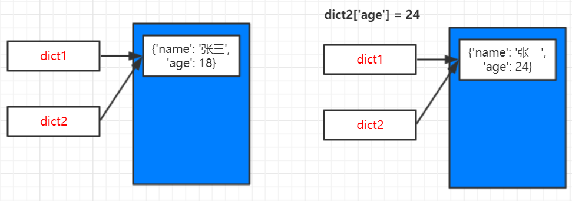

# 可变类型-字典

**dict**是可变类型


```
dict1 = {'name': '张三', 'age': 18}
dict2 = dict1
print("dict1=%s, dict2=%s" % (dict1, dict2))
print("dict1 id=%d, dict2 id=%d" % (id(dict1), id(dict2)))

print("----------------------------")
dict2['age'] = 24  # 修改字典数据
print("dict1=%s, dict2=%s" % (dict1, dict2))
print("dict1 id=%d, dict2 id=%d" % (id(dict1), id(dict2)))
```

> **输出：**

```
dict1={'name': '张三', 'age': 18}, dict2={'name': '张三', 'age': 18}
dict1 id=77849104, dict2 id=77849104
----------------------------
dict1={'name': '张三', 'age': 24}, dict2={'name': '张三', 'age': 24}
dict1 id=77849104, dict2 id=77849104
```

> **分析：**

`dict1=dict2`两个变量指向同一内存区域，id相同。

`dict2['age'] = 24`添加新元素，修改了集合，但是id和之前是一样的。

**修改了字典，但是id没改变，说明还是同一块内存区域。同一个内存区域中的值（value）能够修改，说明dict是可变类型。**


