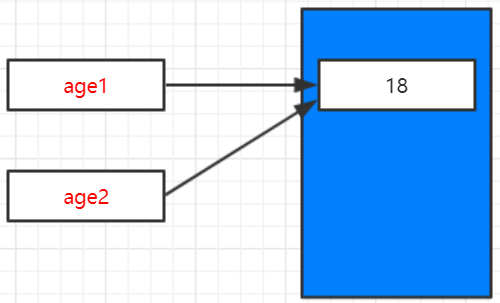

# 可变类型与不可变类型

### A.类型说明

| 可变类型（mutable） | 不可变类型（unmutable） |
| :---: | :---: |
| 列表、字典、集合 | 数字、字符、元组 |

### B.名词解释

概念：这里的可变类型与不可变类型，指的是，内存中存储的内容（value）是否能被修改。能修改则为可变类型，否则是不可变类型。


### C.例子


```
age1 = 18
age2 = age1
print("age1=%d,age2=%d" % (age1, age2))
print("age1 id=%d，age2 id=%d" % (id(age1), id(age2)))

print("----------------------------")

age2 += 10
print("age1=%d,age2=%d" % (age1, age2))
print("age1 id=%d，age2 id=%d" % (id(age1), id(age2)))

```

> **输出：**

```
age1=18,age2=18
age1 id=500226112，age2 id=500226112
----------------------------
age1=18,age2=28
age1 id=500226112，age2 id=500226272
```

> **分析：**

`name2=name1`两个变量指向同一块内存区域，id相同



`name2 += 10`由于数字为**不可变**类型，所以name2不再指向name1所属内存区域，而是重新分配区域，通过id()函数可知两个变量不同

