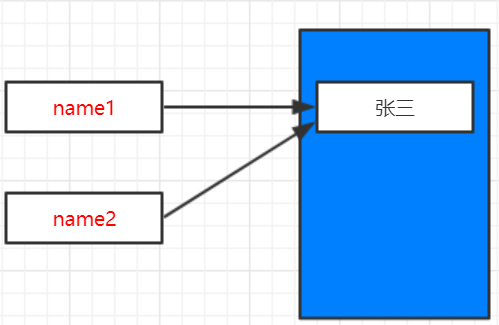
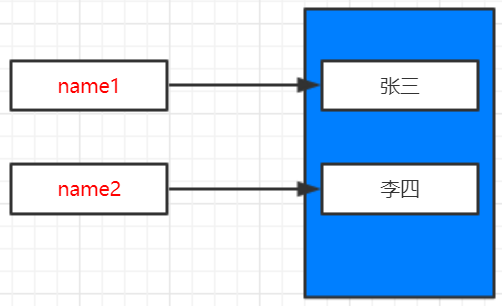

# 不可变类型-字符串


字符串也是不可变类型


```
name1 = "张三"
name2 = name1
print("name1=%s, name2=%s" % (name1, name2))
print("name1 id=%d,name2 id=%d" % (id(name1), id(name2)))

print("----------------------------")

name2 = "李四"
print("name1=%s, name2=%s" % (name1, name2))
print("name1 id=%d,name2 id=%d" % (id(name1), id(name2)))

```

> **输出：**

```
name1=张三, name2=张三
name1 id=83329776,name2 id=83329776
----------------------------
name1=张三, name2=李四
name1 id=83329776,name2 id=83329920
```

> **分析：**

`name2=name1`两个变量指向同一内存区域，id相同





`name2 = "李四"`由于字符串为**不可变**类型，所以name2不再指向name1所属内存区域，而是申请新的内存区域，通过id()函数可知两个变量不同。


