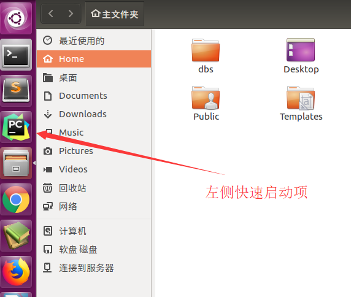
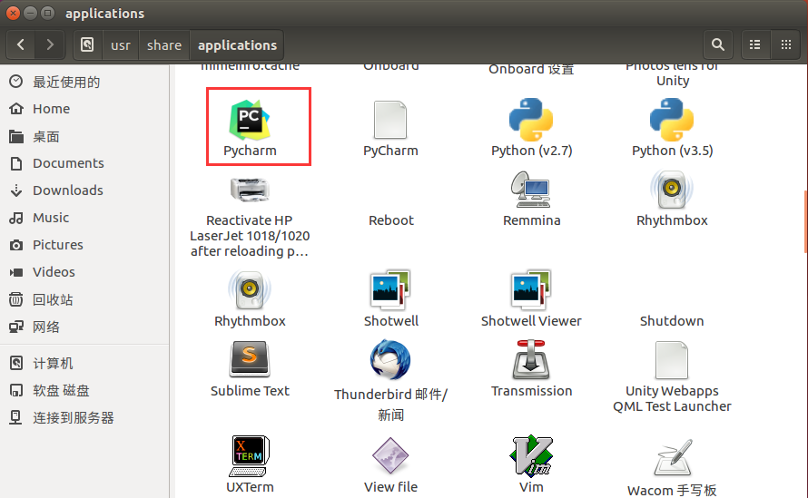
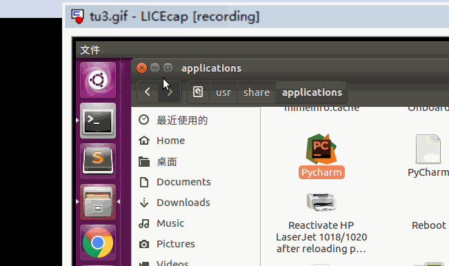

### Ubuntu给软件添加快速启动项

> 系统说明：ubuntu版本：16.04

> 快速启动软件例子：pycharm

### 1.介绍

> 安装软件，每次都./xxx.sh启动，很麻烦，想要添加到左侧快速启动栏。

### 2.配置Pycharm.desktop

* 这里以pycharm软件快速启动项为例子，
* 安装完pycharm后，在/usr/share/applications目录下创建Pycharm.desktop，文件名自己指定。

		sudo touch /usr/share/applications/Pycharm.desktop

* 创建完成，vim编辑Pycharm.desktop,输入如下内容。关于vim编辑器使用请参考其他章节，保存并退出：
	* Exec指向应用程序执行文件xxx.sh对应目录
	* Icon指向应用程序图标xxx.png对应目录

			[Desktop Entry]
			Name=Pycharm
			Comment=Pycharm:The Python IDE
			Exec=/opt/pycharm-2017.3.2/bin/pycharm.sh
			Icon=/opt/pycharm-2017.3.2/bin/pycharm.png
			Terminal=false
			Type=Application
			Categories=Development; 

### 3./usr/share/applications目录查看快速启动项

* 上面步骤完成，即可在/usr/share/applications目录下看到应用程序图标，双击可打开。

     

### 4.添加到快速启动项

* 拖动/usr/share/applications目录下应用程序xxx.desktop到左侧快速启动栏

                       